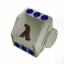

# AIscm [](https://www.gnu.org/copyleft/gpl.html) [](https://circleci.com/gh/wedesoft/aiscm)

[**AIscm**][1] is a **real-time computer vision extension** for the
[**Guile programming language**][2]. Performance in Scheme is achieved by means
of a JIT compiler.



## Download

You can download and unpack the current version like this

```Shell
wget https://github.com/wedesoft/aiscm/archive/master.tar.gz -O aiscm-master.tar.gz
```

## Dependencies

The dependencies can be installed like this

```Shell
sudo aptitude install colorgcc guile-2.0-dev linux-libc-dev libmjpegtools-dev libx11-dev libxext-dev libxv-dev libxmu-dev libxi-dev libglu1-mesa-dev libgl1-mesa-dev libswscale-dev pandoc
```

## Installation

Finally you can install the stuff

```Shell
tar xzf aiscm-*.tar.gz
cd aiscm-*
./configure CC=colorgcc
make -j 4
make check -j 4
sudo make install
```

## See also

* [AIscm homepage][1]
* [AIscm packages for Debian 8.0][3]

## External links

* [Torch: Scientific computing for LuaJIT](http://torch.ch/)
* [Ceemple C++ OpenCV IDE](http://www.ceemple.com/)
* [PeachPy: Portable assembly for Python](https://github.com/Maratyszcza/PeachPy)
* [Guile manual](http://www.gnu.org/software/guile/manual/)
* [GOOPS: object-oriented extension to Guile](https://www.gnu.org/software/goops/)
* [COOPS: Chicken Scheme object system](http://wiki.call-cc.org/eggref/4/coops)
* [System V Application Binary Interface](http://www.x86-64.org/documentation/abi.pdf)
* [Intel® 64 and IA-32 Architectures Software Developer Manuals](http://www.intel.com/content/www/us/en/processors/architectures-software-developer-manuals.html)

[1]: http://www.wedesoft.de/aiscm/ "AIscm"
[2]: http://www.gnu.org/software/guile/ "Guile"
[3]: http://software.opensuse.org/download.html?project=home%3Awedesoft&package=aiscm
[4]: https://github.com/wedesoft/aiscm/releases
