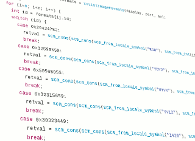

# Installation

## Using binary package

<div class="figure"></div>

There are AMD64 binaries for
[](https://www.debian.org/) Jessie (8),
[](https://www.debian.org/) Stretch (9),
[](https://www.debian.org/) Sid (10),
[](http://www.ubuntu.com/) Trusty (14.04), and
[](http://www.ubuntu.com/) Xenial (16.04)

To install the software, you have to add the AIscm repository to your list of repositories and install via *apt-get*. To do this, paste the following lines into your terminal:

```
echo "deb https://wedesoft.github.io/aiscm/apt `lsb_release -cs` main" | sudo tee /etc/apt/sources.list.d/aiscm.list
wget -qO- https://wedesoft.github.io/aiscm/apt/pubkey.gpg | sudo apt-key add -
sudo apt-get update
sudo apt-get install aiscm
```

If you wish, you can additionally register the sources with *apt*:

```
echo "deb-src https://wedesoft.github.io/aiscm/apt `lsb_release -cs` main" | sudo tee -a /etc/apt/sources.list.d/aiscm.list
```

## Compile from source

<div class="figure"></div>

### Get the source code

You can download the latest release like this:

```
wget `curl -s https://api.github.com/repos/wedesoft/aiscm/releases/latest | grep download_url | cut -d '"' -f 4`
```

### Install dependencies

You need to install the dependencies:

```
@dependencies.sh@
```

### Build AIscm

The software then can be unpacked and installed as follows:

```
tar xJf aiscm-*.tar.xz
cd aiscm-*
./configure
make -j
sudo make install
```

## Recommendations

It is recommended to enable a REPL with history and colorized output.
*I.e.* install [guile-colorized][1] and then create a file ```~/.guile``` with the following content.

```
(use-modules (ice-9 readline))
(activate-readline)

(use-modules (ice-9 colorized))
(activate-colorized)
```

[1]: https://github.com/NalaGinrut/guile-colorized
