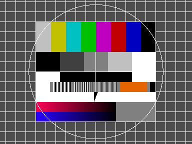

# Input/output

The I/O modules provide sources (and sinks) for video and audio data.

## Loading/saving images using ImageMagick

An image can be read from disk using *read-image* which uses the ImageMagick library to load the image.



```Scheme
@../tests/integration/read_image.scm@
```

*write-image* writes an image to disk.

```Scheme
@../tests/integration/write_image.scm@
```


## Xorg display
### Images

As shown above, you can display images using the method *show*:

```Scheme
@../tests/integration/read_image.scm@
```

One can also display a list of images:


```Scheme
@../tests/integration/xorg_image_list.scm@
```

### Videos

It is also possible to display a video using the *show* method:

```Scheme
@../tests/integration/xorg_video.scm@
```

A function returning lists of images can be used to display multiple videos synchronously.

```Scheme
@../tests/integration/xorg_video_list.scm@
```

If necessary, one can also handle the display and window objects directly.
Possible types of output are *IO-XIMAGE*, *IO-OPENGL*, and *IO-XVIDEO*.

```Scheme
@../tests/integration/xorg_window.scm@
```

## Video for Linux version 2 (V4L2)


As shown above already, you can open a camera and grab a frame as follows.

```Scheme
@../tests/integration/grab.scm@
```

It is also possible to specify the device, a channel, and a closure for selecting the video mode.

```Scheme
@../tests/integration/camera_mode.scm@
```

## Pulse audio

The following example program creates a sine wave and outputs it to the audio device.

```Scheme
@../tests/integration/pulse_out.scm@
```

The *drain* method waits for the content of the audio buffer to finish playing.
The method *flush* (not shown here) can be used to empty the audio buffer.

Audio data can be recorded in a similar fashion.
The following example records 3 seconds of audio data and then plays it back.

```Scheme
@../tests/integration/pulse_in.scm@
```

## Video files

### Input

The following example shows how to use the FFmpeg interface to open and view a video.
The video presentation time stamps are used to display the video at the correct speed.
The method *latency* is used to determine the delay of the audio buffer.

```Scheme
@../tests/integration/ffvideo.scm@
```

The method *pts=* can be used to seek to an absolute position in audio/video streams:

```Scheme
@../tests/integration/pts.scm@
```

### Output

The *FFmpeg* bindings can also be used to write a video stream to a file.
By default the file format is determined by the file name extension.

```Scheme
@../tests/integration/ffwritevideo.scm@
```

## Audio files

### Input

One can play samples from an audio file by passing them to the audio device using the *write-audio* method.
It is also possible to pass a function returning consecutive audio samples as shown below.

```Scheme
@../tests/integration/ffaudio.scm@
```

### Output

One can write audio samples to an audio file.
When opening the output file, the sample rate, sample type, and number of channels need to be specified.
The following sample creates an audio file of 3 seconds length with a 1000 Hz sine wave.

```Scheme
@../tests/integration/ffwriteaudio.scm@
```

## Video/Audio files

### Input

Video/audio files usually contain a video and an audio stream.
The following example displays video frames and plays audio data in a synchronised way.

```Scheme
@../tests/integration/ffplay.scm@
```

Note that *FFmpeg* also supports network streaming of video data.
I.e. the following example will play the [Sintel short film](https://durian.blender.org/) from a web server.

<div class="figure">
<a href="http://peach.themazzone.com/durian/movies/sintel-1024-surround.mp4"></a>
</div>

```Scheme
@../tests/integration/ffstream.scm@
```

### Output

When recording video and audio, the methods *write-image* and *write-audio* are used to write video frames and audio samples.
The following example records video frames using Video4Linux2 and audio samples using Pulse audio.

```Scheme
@../tests/integration/ffwrite.scm@
```
